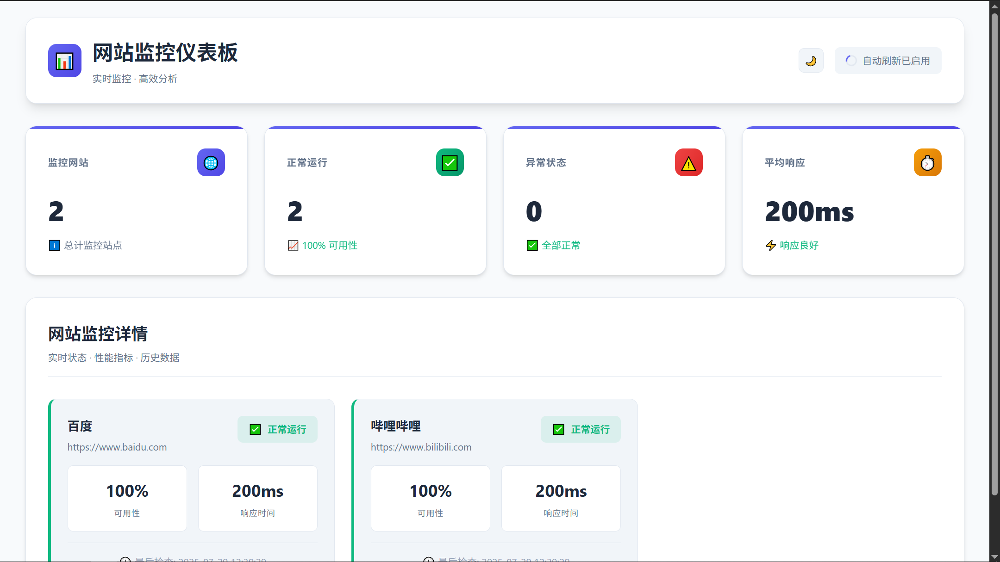

# Website Monitoring System

A comprehensive, lightweight website monitoring solution built with shell scripts that provides benign monitoring capabilities without complex dependencies.



## 🚀 Features

- **Multi-Website Monitoring**: Monitor multiple websites simultaneously with configurable intervals
- **Real-time Availability Tracking**: Continuous monitoring with instant status updates
- **Content Change Detection**: SHA256-based content monitoring to detect website changes
- **Response Time Analysis**: Detailed performance metrics and slow response alerts
- **Comprehensive Reporting**: Generate reports in multiple formats (HTML, CSV, Text)
- **Interactive Log Viewer**: Real-time log analysis with filtering and search capabilities
- **Error Recovery**: Advanced error handling with circuit breaker patterns and exponential backoff
- **Daemon Management**: Full lifecycle management with start/stop/restart capabilities
- **Concurrent Processing**: Efficient multi-website monitoring with configurable concurrency
- **Health Monitoring**: Automatic daemon health checks and recovery

## 📋 Requirements

### System Requirements

- Unix/Linux environment (tested on Ubuntu)
- Bash 4.0 or higher
- Standard POSIX utilities

### Dependencies

```bash
curl grep awk sed sort uniq wc date sha256sum mktemp
```

Most dependencies are pre-installed on standard Unix/Linux systems.

## 🛠️ Installation

### Quick Installation

1. **Download and extract the system**:

   ```bash
   git clone <repository-url>
   cd website-monitoring-system
   ```

2. **Initialize the system**:

   ```bash
   ./bin/system-init.sh init
   ```

3. **Configure websites to monitor**:

   ```bash
   nano config/websites.conf
   ```

   Add your websites in the format:

   ```
   https://example.com|Example Site|60|10|false
   https://api.service.com|API Service|30|15|true
   ```

4. **Start monitoring**:
   ```bash
   ./bin/system-init.sh start
   ```

### Manual Installation

1. **Set up directories**:

   ```bash
   ./bin/system-init.sh setup
   ```

2. **Validate configuration**:

   ```bash
   ./bin/system-init.sh validate
   ```

3. **Start the system**:
   ```bash
   ./bin/system-init.sh start
   ```

## 📖 Usage

### Basic Commands

```bash
# System Management
./bin/system-init.sh init      # Initialize complete system
./bin/system-init.sh start     # Start monitoring
./bin/system-init.sh stop      # Stop monitoring
./bin/system-init.sh restart   # Restart monitoring
./bin/system-init.sh status    # Show system status

# Individual Components
./bin/check-website.sh https://example.com    # Check single website
./bin/report-generator.sh --format html       # Generate HTML report
./bin/log-viewer.sh                          # Interactive log viewer
./bin/monitor.sh status                      # Daemon status
```

### Configuration

#### Monitor Configuration (`config/monitor.conf`)

```bash
# Monitoring intervals (seconds)
MONITOR_INTERVAL=60
MONITOR_TIMEOUT=30
SLOW_RESPONSE_THRESHOLD=5000

# Concurrent monitoring
MAX_CONCURRENT_CHECKS=5
CONCURRENT_TIMEOUT=45

# Content monitoring
CONTENT_CHECK_ENABLED=true
CONTENT_HASH_ALGORITHM=sha256

# Logging
LOG_LEVEL=INFO
LOG_RETENTION_DAYS=30

# Error recovery
MAX_RETRY_ATTEMPTS=3
RETRY_DELAY=5
CIRCUIT_BREAKER_THRESHOLD=5
```

#### Websites Configuration (`config/websites.conf`)

```bash
# Format: URL|Name|Interval|Timeout|ContentCheck
https://www.example.com|Main Website|60|10|true
https://api.example.com|API Endpoint|30|15|false
https://cdn.example.com|CDN Service|120|20|false
```

## 📊 Monitoring Features

### Website Checking

- HTTP/HTTPS availability monitoring
- Response time measurement
- HTTP status code validation
- SSL certificate validation
- Custom timeout settings
- Retry mechanisms with exponential backoff

### Content Monitoring

- SHA256 content hashing
- Change detection and alerting
- Content comparison history
- Configurable content check intervals

### Performance Monitoring

- Response time tracking
- Slow response alerts
- Performance trend analysis
- Statistical reporting

### Error Recovery

- Circuit breaker pattern implementation
- Exponential backoff retry strategies
- Health monitoring and auto-recovery
- Graceful degradation during failures

## 📈 Reporting

### Report Formats

- **HTML**: Rich visual reports with charts and statistics
- **CSV**: Data export for analysis and integration
- **Text**: Simple text-based reports for email/console

### Report Types

- **Daily Reports**: 24-hour monitoring summary
- **Weekly Reports**: 7-day trend analysis
- **Monthly Reports**: Long-term performance overview
- **Custom Period**: User-defined date ranges

### Generate Reports

```bash
# Daily HTML report
./bin/report-generator.sh --format html --period daily

# Weekly CSV export
./bin/report-generator.sh --format csv --period weekly --output weekly-data.csv

# Custom period report
./bin/report-generator.sh --format html --period custom \
  --start-date 2025-01-01 --end-date 2025-01-31
```

## 🔍 Log Viewer

Interactive log analysis with multiple viewing modes:

```bash
# Real-time monitoring view
./bin/log-viewer.sh

# Statistical analysis
./bin/log-viewer.sh --stats

# Filter by website
./bin/log-viewer.sh --website https://example.com

# Search for specific events
./bin/log-viewer.sh --search "timeout"

# Auto-refresh mode
./bin/log-viewer.sh --auto-refresh --refresh 10
```

## 🏗️ Architecture

```
┌─────────────────────────────────────────────────────────────┐
│                    Website Monitoring System                │
├─────────────────────────────────────────────────────────────┤
│  ┌─────────────┐  ┌─────────────┐  ┌─────────────┐         │
│  │   System    │  │   Monitor   │  │   Website   │         │
│  │    Init     │  │   Daemon    │  │   Checker   │         │
│  │ system-init │  │ monitor.sh  │  │check-website│         │
│  │    .sh      │  │             │  │    .sh      │         │
│  └─────────────┘  └─────────────┘  └─────────────┘         │
│         │                 │                 │              │
│         └─────────────────┼─────────────────┘              │
│                           │                                │
│  ┌─────────────┐  ┌─────────────┐  ┌─────────────┐         │
│  │   Report    │  │     Log     │  │   Shared    │         │
│  │  Generator  │  │   Viewer    │  │ Libraries   │         │
│  │report-gen.sh│  │log-viewer.sh│  │   lib/      │         │
│  └─────────────┘  └─────────────┘  └─────────────┘         │
├─────────────────────────────────────────────────────────────┤
│                    Data Storage Layer                       │
│  ┌─────────────┐  ┌─────────────┐  ┌─────────────┐         │
│  │    Logs     │  │   Content   │  │   Reports   │         │
│  │ data/logs/  │  │data/content-│  │data/reports/│         │
│  │             │  │   hashes/   │  │             │         │
│  └─────────────┘  └─────────────┘  └─────────────┘         │
└─────────────────────────────────────────────────────────────┘
```

## 📁 Directory Structure

```
website-monitoring-system/
├── bin/                    # Executable scripts
│   ├── system-init.sh      # System initialization and management
│   ├── monitor.sh          # Main monitoring daemon
│   ├── check-website.sh    # Individual website checker
│   ├── report-generator.sh # Report generation utility
│   └── log-viewer.sh       # Interactive log viewer
├── config/                 # Configuration files
│   ├── monitor.conf        # System configuration
│   └── websites.conf       # Website configuration
├── data/                   # Data storage
│   ├── logs/              # Monitoring logs
│   ├── content-hashes/    # Content comparison data
│   ├── reports/           # Generated reports
│   ├── temp/              # Temporary files
│   └── error-recovery/    # Error recovery data
├── lib/                   # Shared libraries
│   ├── common.sh          # Common utilities
│   ├── config-utils.sh    # Configuration management
│   ├── http-utils.sh      # HTTP utilities
│   ├── log-utils.sh       # Logging utilities
│   ├── advanced-monitoring.sh # Advanced monitoring features
│   └── error-recovery.sh  # Error recovery mechanisms
├── test/                  # Testing framework
│   ├── run-tests.sh       # Test runner
│   ├── test-framework.sh  # Test framework
│   └── test-*.sh          # Individual test suites
└── docs/                  # Documentation
    ├── SYSTEM_INTEGRATION.md
    └── USAGE_EXAMPLES.md
```

## 🧪 Testing

### Run Tests

```bash
# Run all tests
./test/run-tests.sh

# Run specific test categories
./test/run-tests.sh unit
./test/run-tests.sh integration
./test/run-tests.sh end-to-end

# Run with verbose output and generate report
./test/run-tests.sh -v -r all
```

### Test Categories

- **Unit Tests**: Individual component testing
- **Integration Tests**: Component interaction testing
- **End-to-End Tests**: Complete workflow testing
- **Performance Tests**: Load and performance testing
- **Validation Tests**: Configuration and setup validation

## 🔧 Advanced Configuration

### Environment Variables

```bash
export CONFIG_DIR="/custom/config/path"
export DATA_DIR="/custom/data/path"
export LOG_LEVEL="DEBUG"
```

### Custom Monitoring Intervals

```bash
# High-frequency monitoring for critical services
https://critical-api.com/health|Critical API|15|5|false

# Standard monitoring for regular services
https://website.com|Website|60|10|true

# Low-frequency monitoring for background services
https://backup.service.com|Backup Service|300|30|false
```

### Multi-Environment Setup

```bash
# Production environment
CONFIG_DIR="environments/production/config" \
DATA_DIR="environments/production/data" \
./bin/system-init.sh start

# Staging environment
CONFIG_DIR="environments/staging/config" \
DATA_DIR="environments/staging/data" \
./bin/system-init.sh start
```

## 🚨 Troubleshooting

### Common Issues

1. **Daemon won't start**:

   ```bash
   # Check configuration
   ./bin/system-init.sh validate

   # Check logs
   tail -f data/logs/monitoring.log
   ```

2. **High memory usage**:

   ```bash
   # Reduce concurrent checks
   echo "MAX_CONCURRENT_CHECKS=3" >> config/monitor.conf
   ```

3. **Network connectivity issues**:
   ```bash
   # Test individual website
   ./bin/check-website.sh --verbose https://example.com
   ```

### Debug Mode

```bash
# Enable debug logging
echo "LOG_LEVEL=DEBUG" >> config/monitor.conf
./bin/system-init.sh restart
```

### Log Analysis

```bash
# Check recent errors
tail -100 data/logs/monitoring.log | grep ERROR

# Monitor daemon health
./bin/monitor.sh status

# View system status
./bin/system-init.sh status
```

## 🔒 Security

### File Permissions

```bash
# Set secure permissions
chmod 750 bin/*.sh
chmod 640 config/*.conf
chmod 700 data/
```

### Network Security

- Uses standard HTTP/HTTPS protocols
- No incoming network connections required
- Configurable user agent strings
- SSL certificate validation

## 📄 License

This project is licensed under the MIT License - see the LICENSE file for details.
